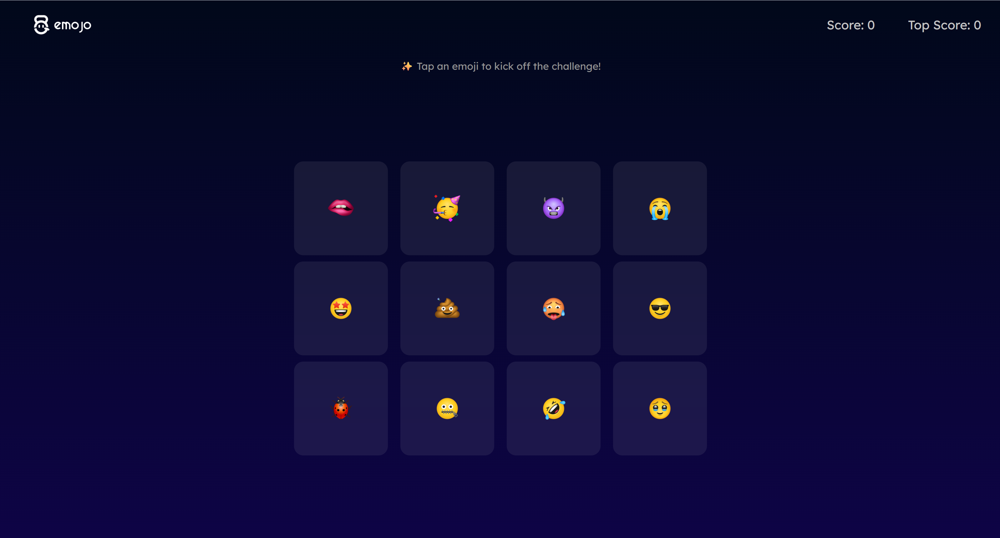
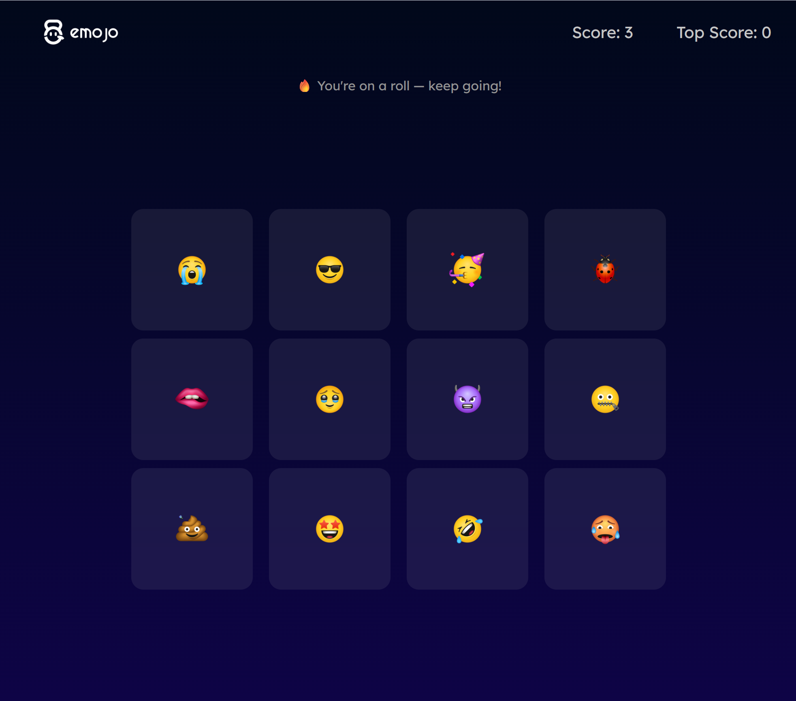
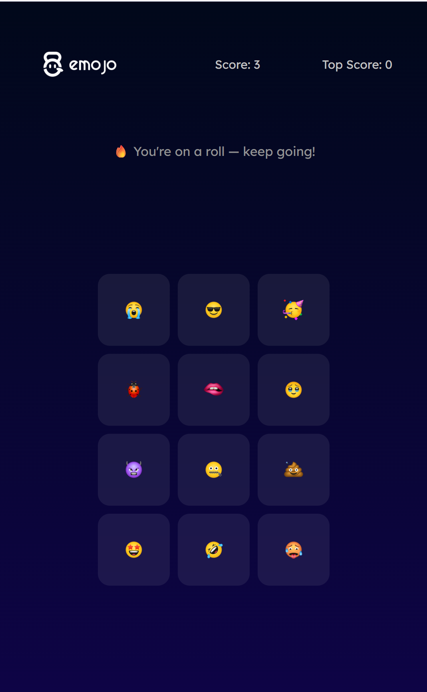
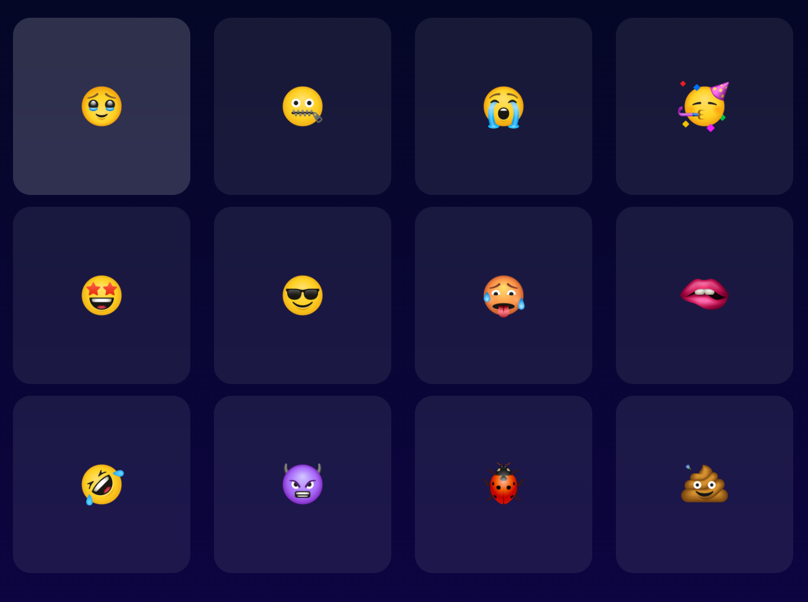
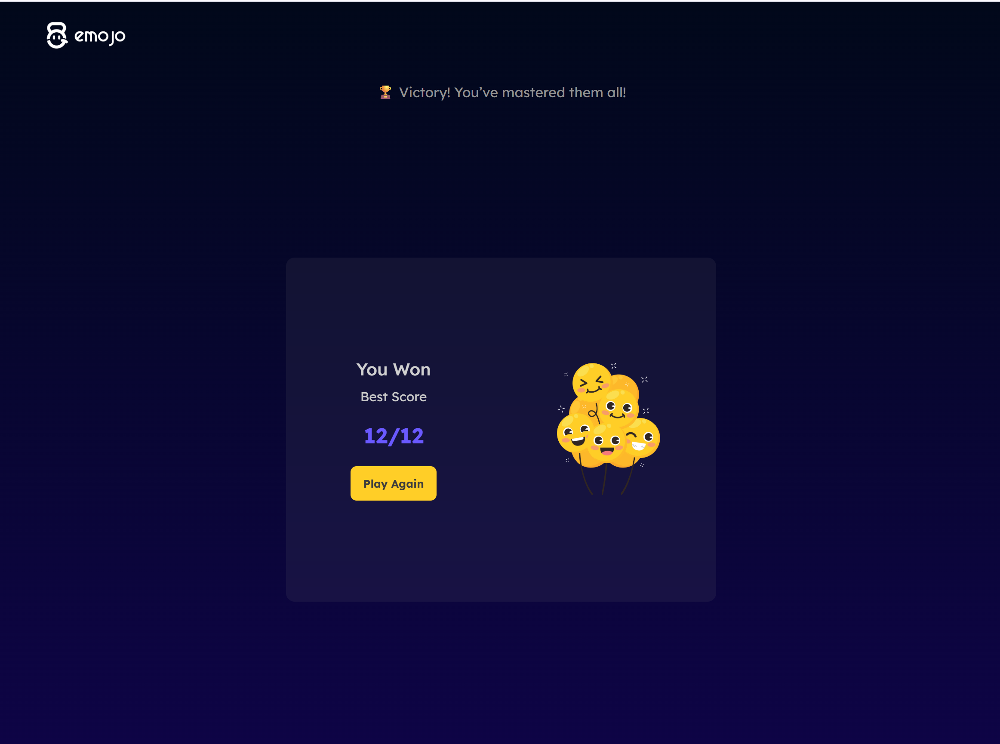

#  emojo – Emoji Memory Game  

Emojo is a **React-based memory challenge game** where players tap unique emojis without repeating any selection.  
It demonstrates strong **React development skills**, state management, and a fun, interactive **UI/UX** experience.  

---

  

---

##  Key Features  

- **Memory Challenge Gameplay**  
  - Tap emojis without selecting the same one twice.  
  - The order of emojis **shuffles after every click** for extra difficulty.  

- **Score & High Score Tracking**  
  - Current score updates in real-time as you play.  
  - **High score persists** for the session to encourage replayability.  

- **Win or Lose Conditions**  
  - **Win:** Successfully tap all 12 emojis without repeating.  
  - **Lose:** Tap a duplicate emoji — the game ends instantly.  

- **Dynamic Status Updates**  
  - Game status text updates after each action:  
    - Initial message before starting  
    - “You’re on a roll” when playing  
    - Win or Lose messages on completion.
      
-  **Play Again Option**  
  - Restart the game instantly with a single click after a win or loss.  

-  **Modern User Interface**  
  - Built with **React Class & Functional Components** (mix of both).  
  - Smooth animations on emoji click using CSS transitions.  

-  **Responsive Design**  
  - Fully responsive layout optimized for mobile, tablet, and desktop screens.  

---

##  Screenshots  

###  Home Page  
  

###  Emojo on tablet 
  

###  Emojo on mobile 
  

###  when Hover on emoji
  

### 🏆 Win Screen  
  

### 💔 Lose Screen  
  

---

##  Tech Stack  

- **Frontend:** React.js (Class + Functional Components)  
- **State Management:** React `setState`, hooks (`useRef`) for animations  
- **Styling:** CSS3 (animations, responsive layout)  
- **Logic:** Conditional rendering for win/lose screens, score calculation, and shuffle algorithm  

---

## ⚙️ How It Works  

1. **Start the Game**  
   - The game begins when the user clicks any emoji.  

2. **Gameplay**  
   - Click emojis one by one without repeating any previously clicked emoji.  
   - Emojis **shuffle** after each click to increase difficulty.  

3. **Winning or Losing**  
   - **Win:** Click all 12 unique emojis successfully.  
   - **Lose:** Click a duplicate emoji.  

4. **Play Again**  
   - Click **Play Again** to restart with scores reset.  

---

